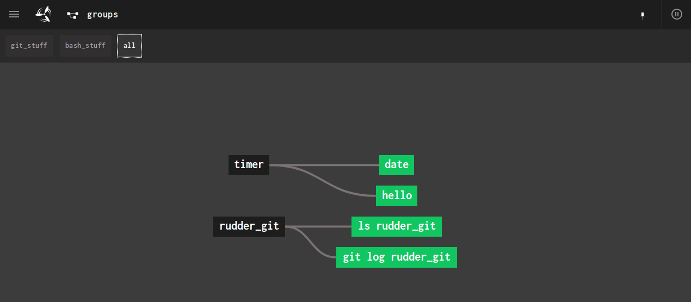
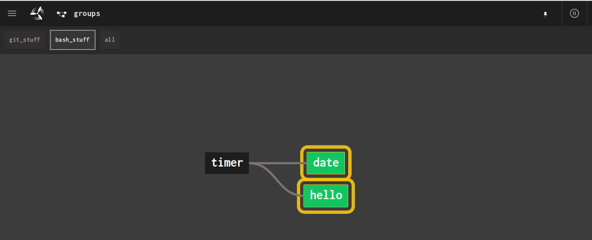
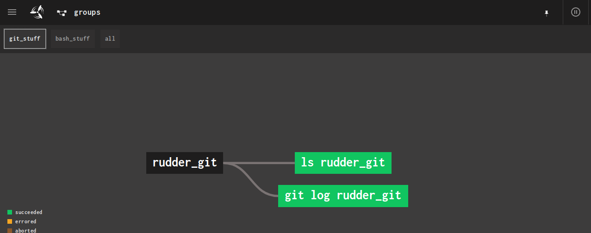

# Groups Example

The [`groups_pipeline.rb`](./groups_pipeline.rb) shows how concourse groups can be utilized
within `rudder`. This pipeline also shows how to indiscriminately import
pipelines from other directories.

- The All group:
  
- The Bash Stuff group:
  
- The Git Stuff group:
  
