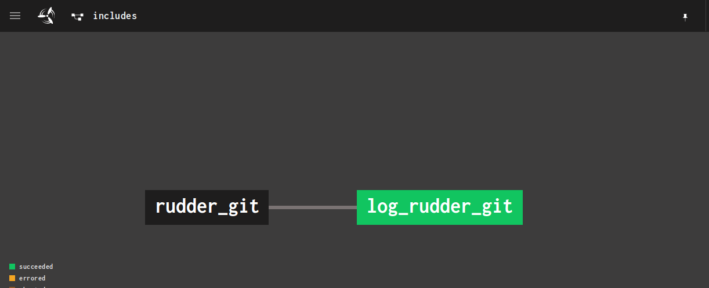

# Includes Example

The [`includes_pipeline.rb`](./includes_pipeline.rb) pipeline shows how to load pipeline components
(jobs, resources, resource_types, groups) from files and include them
into your pipelines.

