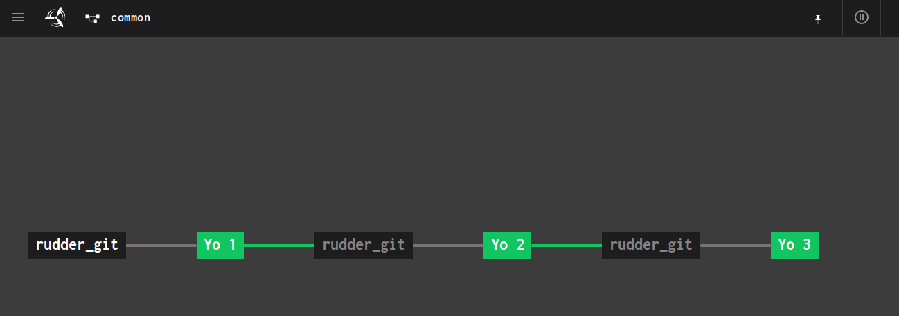
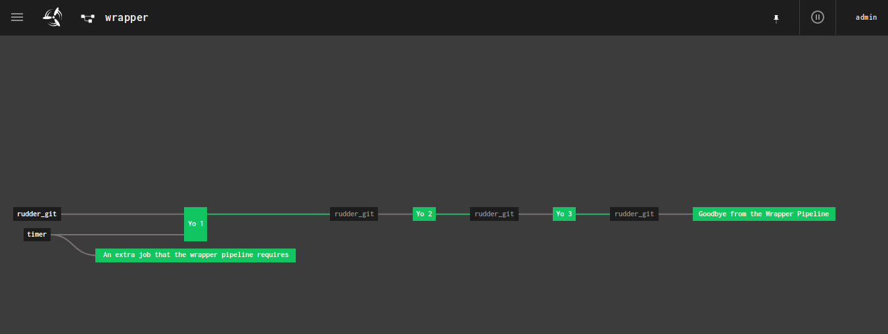
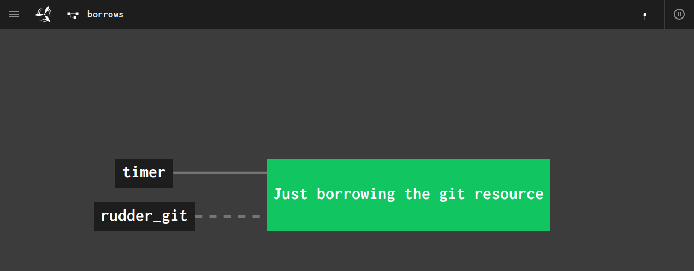

# Shared Example

This example is a bit contrived, but serves to illustrate how joining pipelines works.

[`common_pipeline.rb`](./common_pipeline.rb) is a full, standalone pipeline with resources
and several jobs that is fully flyable.

[`wrapper_pipeline.rb`](./wrapper_pipeline.rb) is another full pipeline that incorporates
the entirety of `common_pipeline.rb` and augments it with an additional timer, one new
job that requires the final job from `common_pipeline.rb`, and its own job that only
depends on a single resource from the common pipeline.

[`borrows_pipeline.rb`](./borrows_pipeline.rb) is a single job pipeline that borrows
the git resource from the `common_pipeline.rb` (actually, it would borrow any git
resource from that pipeline, there just happens to be only one right now).

